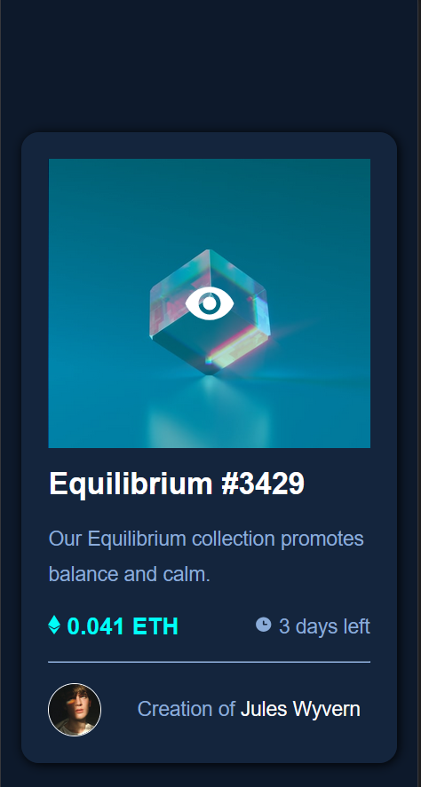

# Frontend Mentor - NFT preview card component solution

This is a solution to the [NFT preview card component challenge on Frontend Mentor](https://www.frontendmentor.io/challenges/nft-preview-card-component-SbdUL_w0U). Frontend Mentor challenges help you improve your coding skills by building realistic projects.

## Table of contents

- [Overview](#overview)
    - [The challenge](#the-challenge)
    - [Screenshot](#screenshot)
    - [Links](#links)
- [My process](#my-process)
    - [Built with](#built-with)
    - [What I learned](#what-i-learned)
- [Author](#author)

## Overview

### The challenge

Users should be able to:

- View the optimal layout depending on their device's screen size
- See hover states for interactive elements

### Screenshot


###### Desktop


###### Mobile with hover 


###### Mobile

### Links

- Solution URL: [Nft Preview Card Component](https://github.com/L-ux-es/Nft-Preview-Card-Component)
- Live Site URL: [Frontend Mentor | Nft Preview Card Component](https://l-ux-es.github.io/Nft-Preview-Card-Component/)

## My process

### Built with

- Semantic HTML5 markup
- CSS custom properties
- Flexbox

### What I learned

```html
<div class="image-container">
            
            <div class="icon-container"></div>
        </div>
```

```css
.icon-container {
    width: 100%;
    height: 100%;
    display: flex;
    justify-content: center;
    align-items: center;
    position: absolute;
    top: 50%;
    left: 50%;
    transform: translate(-50%, -50%);
    opacity: 0;
    transition: all 0.3s;
    cursor: pointer;
}

.image-container:hover .icon-container {
    opacity: 1;
    background-color: hsla(178, 100%, 50%, 30%);
}
```

## Author

- GitHub - [L-ux-es](https://github.com/L-ux-es)
- Frontend Mentor - [@L-ux-es](https://www.frontendmentor.io/profile/L-ux-es)
